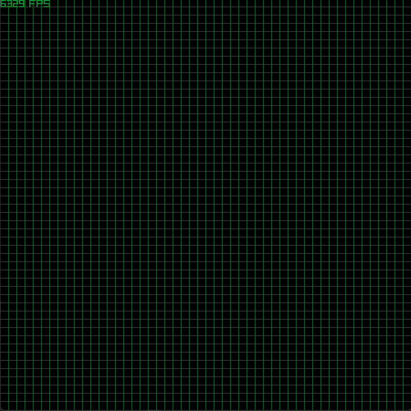

# ParticleSimulator

A very basic particle simulation made in Raylib.

# Building

Visual Studio project files are provided. Simply open the .sln file and build (ctrl + shift + B).

# Config

`config.json` stores the configuration of the whole simulation.
Higher FPS converts to faster simulation as each particle moves by one cell every frame (assuming it is not constrained).